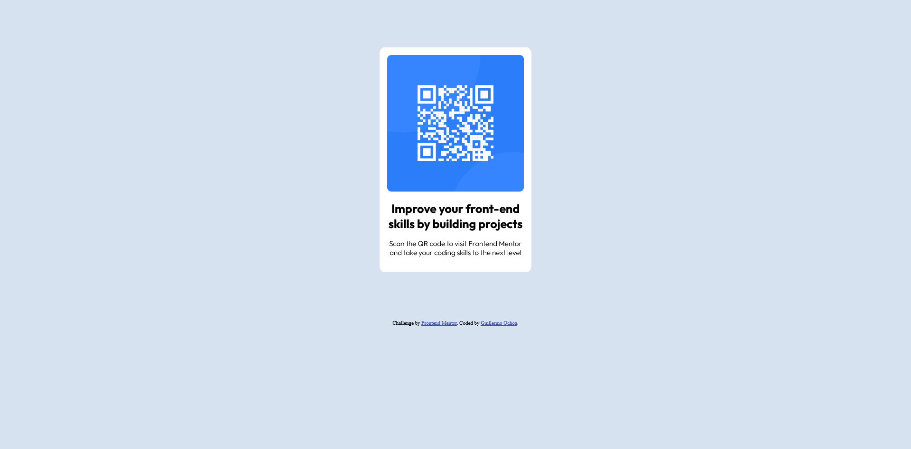

# Frontend Mentor - QR code component solution

This is a solution to the [QR code component challenge on Frontend Mentor](https://www.frontendmentor.io/challenges/qr-code-component-iux_sIO_H). Frontend Mentor challenges help you improve your coding skills by building realistic projects. 

## Table of contents

- [Overview](#overview)
  - [Screenshot](#screenshot)
  - [Links](#links)
- [My process](#my-process)
  - [Built with](#built-with)
  - [What I learned](#what-i-learned)

## Overview

### Screenshot

### Links

- Solution URL: [Add solution URL here](https://www.frontendmentor.io/solutions/first-try-with-plain-css-r87CMFzJz)
- Live Site URL: [Add live site URL here](https://guillermoom.github.io/)

## My process

Simple HTML blocks styled with CSS

### Built with

- Semantic HTML5 markup
- CSS custom properties

### What I learned

how to center a div :)

To see how you can add code snippets, see below:
